# Backend Architecture

This backend is a reusable interview-speed template optimized for AI-assisted feature delivery, predictable scaling, and low-friction refactors.

## System Map

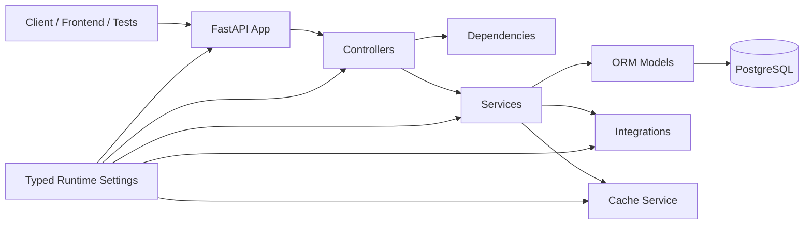

## Repo Layout

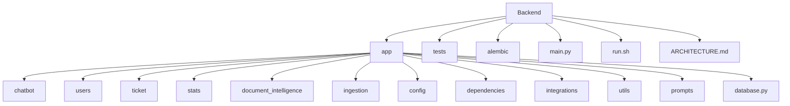

## Request Flow

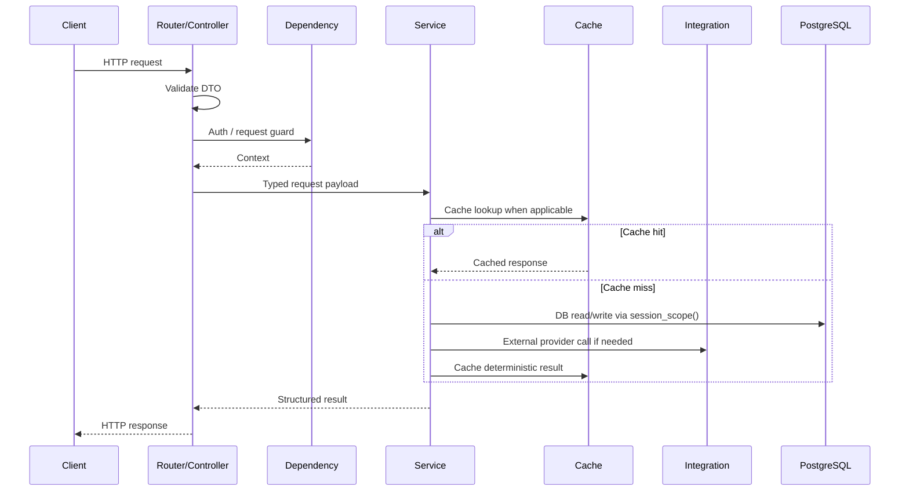

## Startup Flow

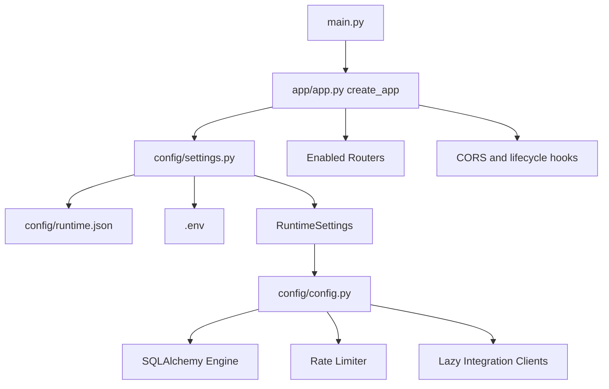

## Configuration Precedence

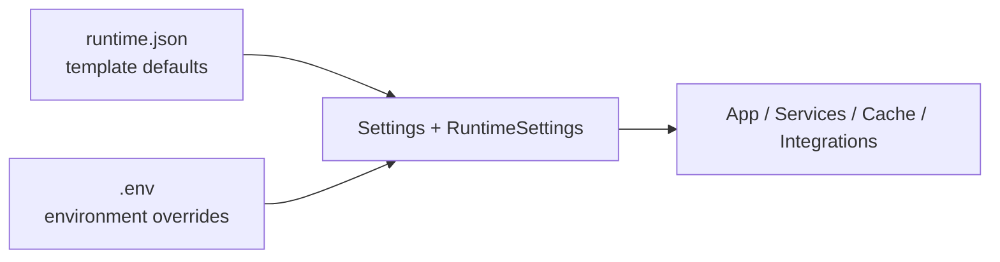

Short rule:

- use `runtime.json` for reusable defaults
- use `.env` for environment-specific values and secrets

## Domain Pattern

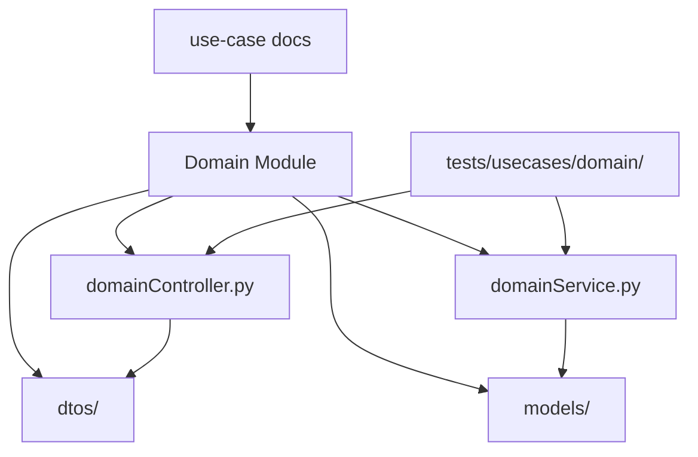

Current domains:

- `chatbot`: chat generation, SSE, persistence
- `users`: auth exchange, JWT verification, user persistence
- `ticket`: ticket lifecycle
- `stats`: conversation analytics
- `document_intelligence`: typed document extraction flows backed by Interfaze
- `ingestion`: scrape, embed, search

## Feature Flags

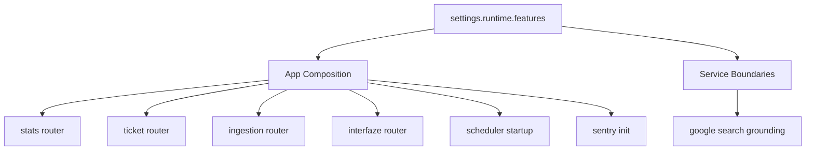

Implemented flags in the current codebase:

- `enable_scheduler`
- `enable_stats`
- `enable_ticketing`
- `enable_ingestion`
- `enable_interfaze`
- `enable_sentry`
- `enable_google_search_grounding`

## Runtime Controls

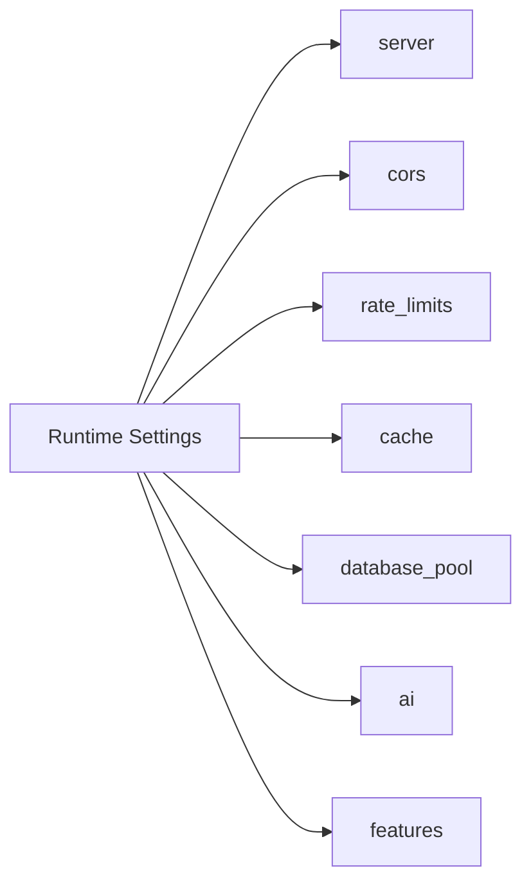

## Interfaze Flow

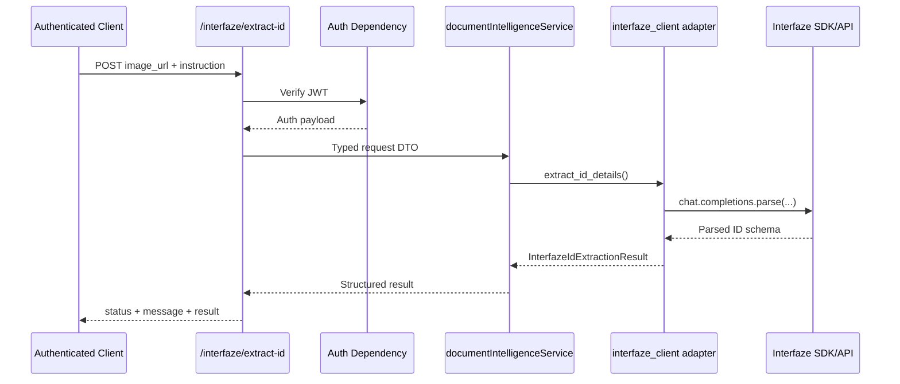

## Caching Strategy

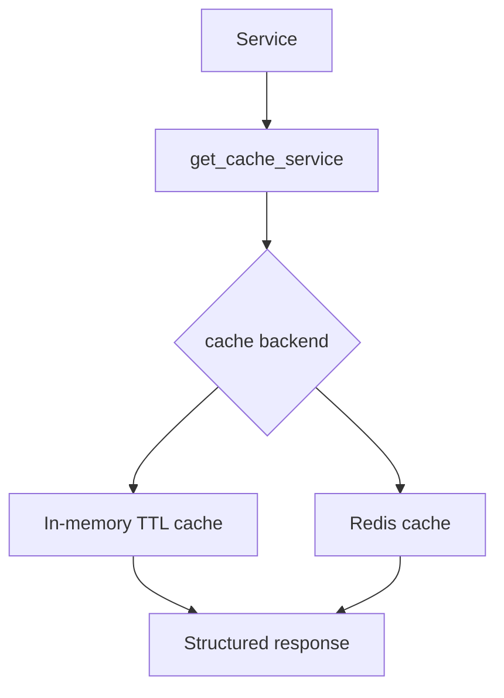

Current posture:

- shared cache abstraction in `app/utils/cache.py`
- in-memory TTL by default
- Redis-ready backend path already modeled
- ingestion search already uses the cache layer

## Dependency And Auth Flow

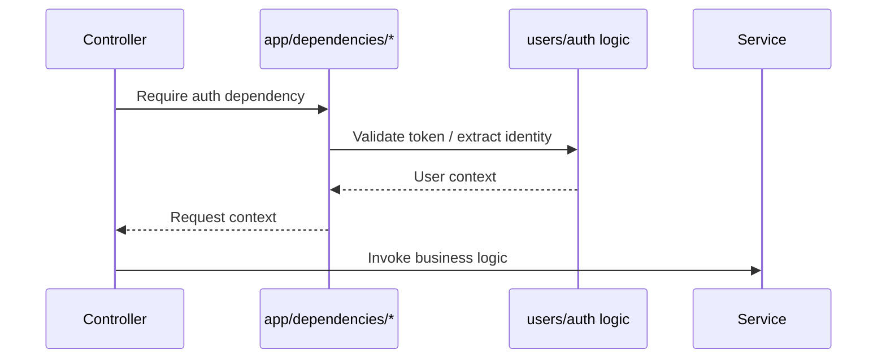

## Integration Boundary

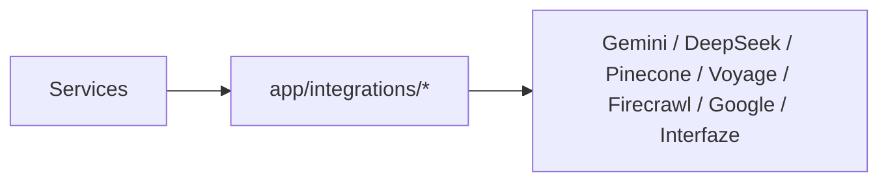

Rule:

- controllers never call provider SDKs directly

## Schema Change Flow

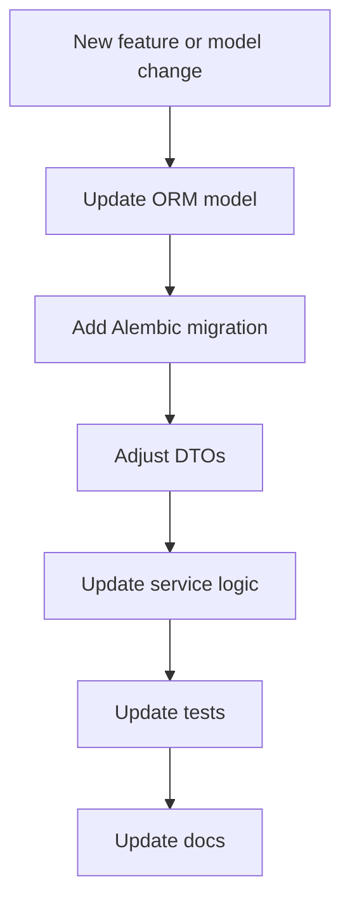

## Feature Delivery Flow

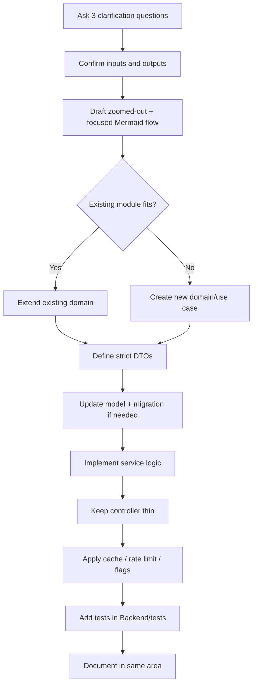

## Testing Map

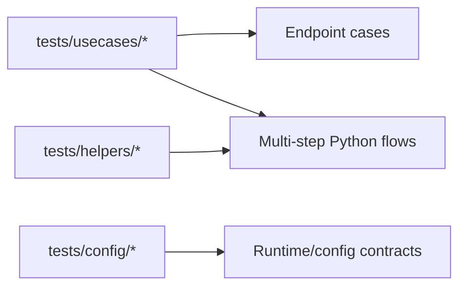

## Guardrails

```mermaid
flowchart TD
    Good[Preferred]
    Avoid[Avoid]

    Good --> G1[Thin controllers]
    Good --> G2[Strict DTOs]
    Good --> G3[Service-owned logic]
    Good --> G4[Shared dependencies]
    Good --> G5[Typed settings]
    Good --> G6[Shared cache abstraction]
    Good --> G7[Alembic-backed schema changes]

    Avoid --> A1[Direct SDK wiring in controllers]
    Avoid --> A2[Hardcoded env-specific values]
    Avoid --> A3[Duplicated auth logic]
    Avoid --> A4[Ad hoc local caches]
    Avoid --> A5[Silent schema drift]
    Avoid --> A6[Docs drifting away from code]
```
