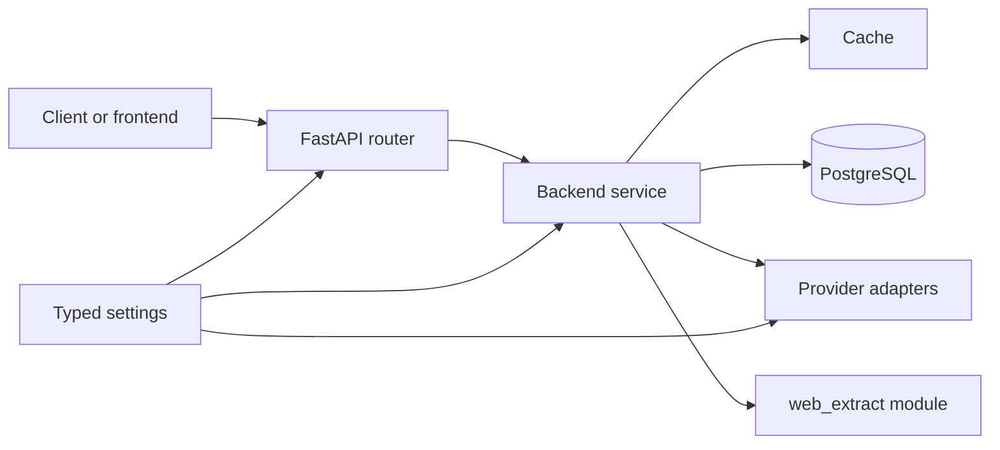
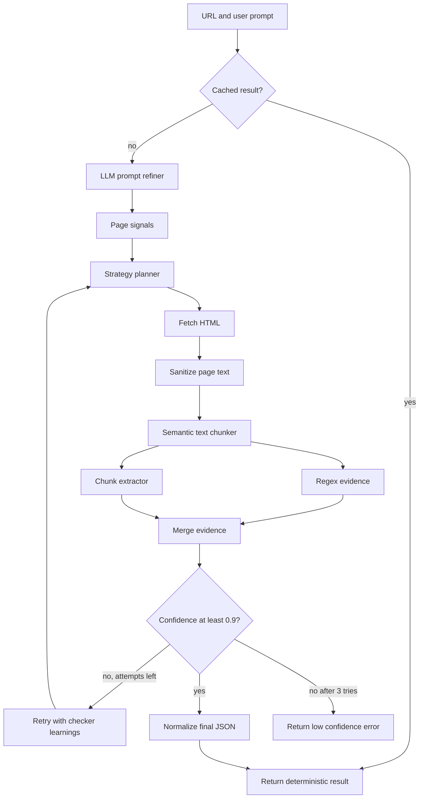
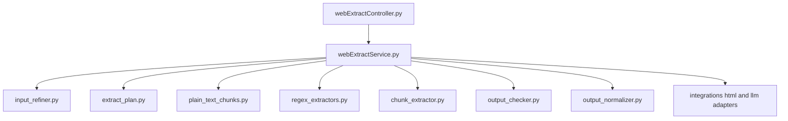

# Backend Architecture

This backend is a FastAPI service with typed settings, service-owned business logic, and a small set of reusable infrastructure pieces. The main module we actively evolved is the web crawler in `app/web_extract/`.

## System Map

## Core Pattern

- Controllers stay thin.
- Services own orchestration and error handling.
- Integrations are called through adapter modules, not directly from controllers.
- Runtime defaults come from `app/config/runtime.json`.
- Environment-specific values come from `.env`.

## Web Crawler

The crawler accepts a public HTTPS URL and a natural-language prompt, then tries to return deterministic JSON with confidence scoring.

### Key Behaviors

- Uses idempotency-key caching for repeat requests.
- Refines short or vague user prompts before planning.
- Builds an extraction contract before collecting evidence.
- Scores output with an LLM-based checker.
- Retries up to 3 times when confidence stays below `0.9`.
- Returns `LOW_CONFIDENCE_EXTRACT` instead of a false success when confidence never reaches the threshold.

## Web Crawler Modules

## Reliability Rules

- Keep request and response DTOs strict.
- Keep provider failures mapped to stable backend errors.
- Prefer deterministic JSON over raw model output.
- Treat caching, retries, and confidence as part of the core contract.
- Add tests whenever planner, checker, or extraction flow changes.

## Verification

Useful checks for this backend area:

- `python -m pytest tests/usecases/web_extract/test_web_extract_service.py`
- `python -m pytest tests/config/test_runtime_contracts.py`
- `npm run docs:mermaid:check`
