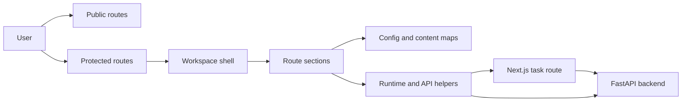
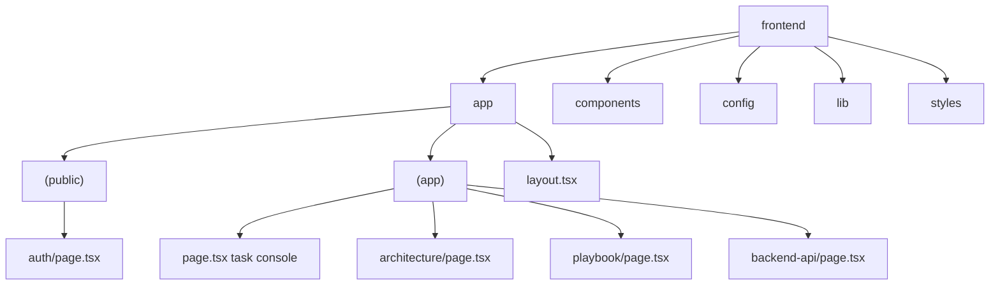
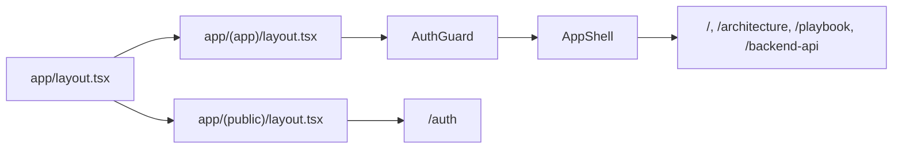
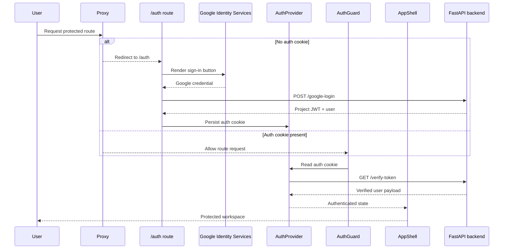
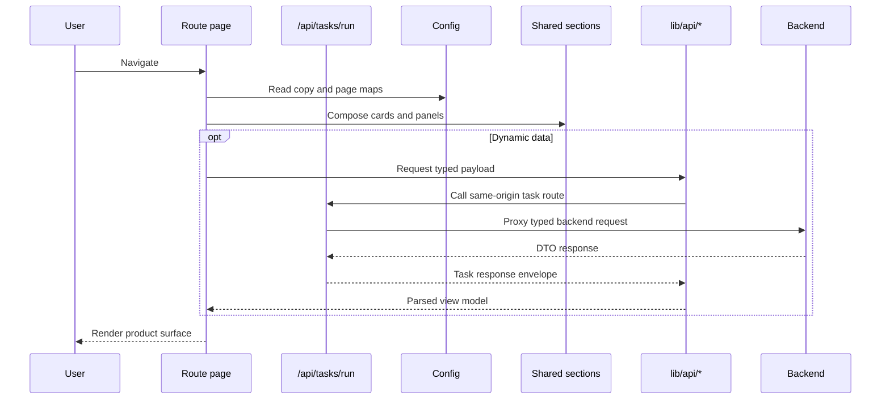
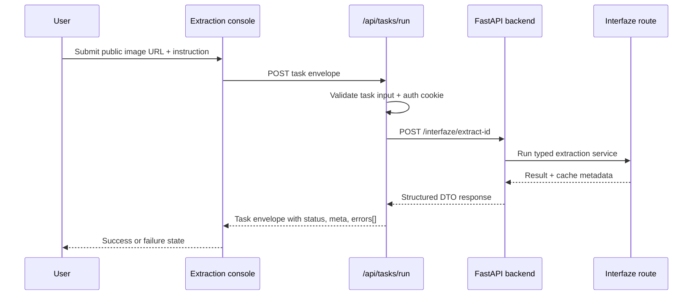
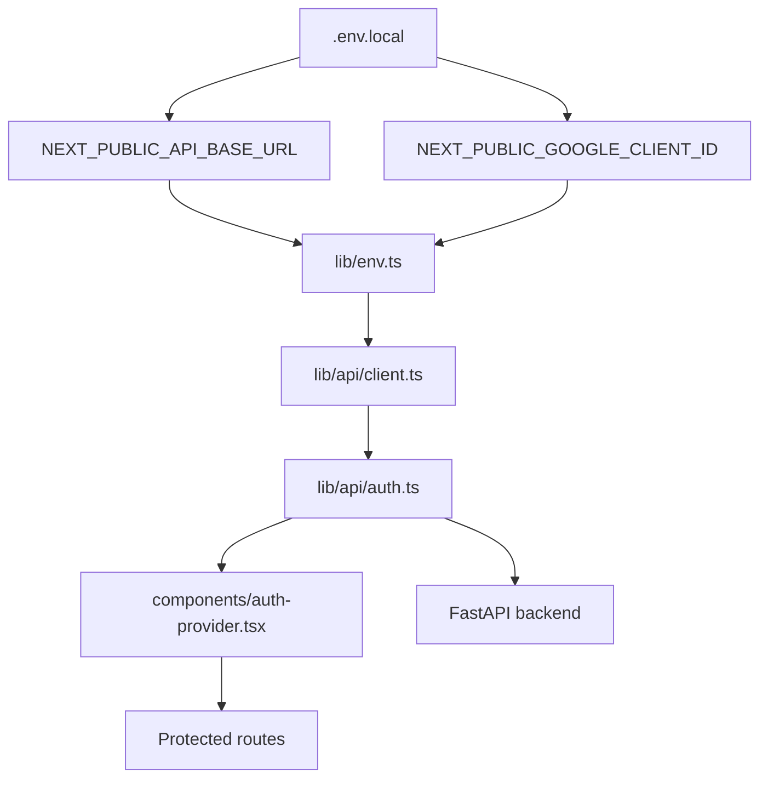
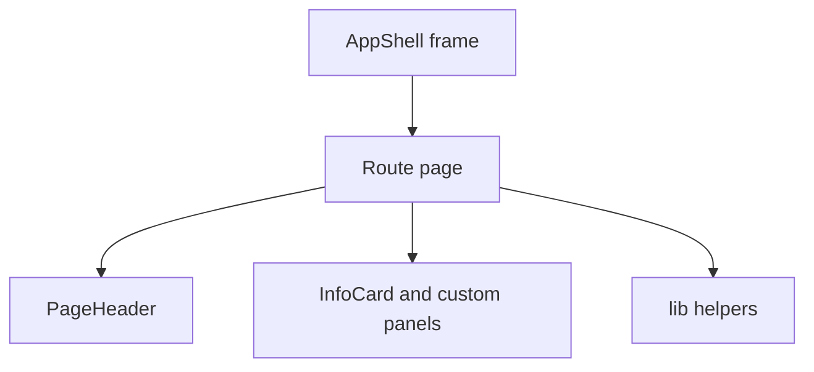
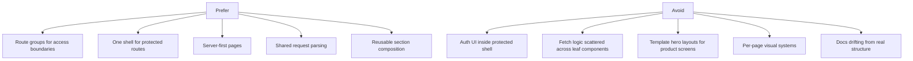

# Frontend Architecture

This frontend is now organized as a practical task workspace: public auth stays isolated, protected routes share one shell, and the main route runs one typed operator workflow instead of acting only as a documentation surface.

## System Map

## Current Layout

## Route Topology

## Auth And Shell Flow

## Rendering Flow

## Task Flow

## Integration Boundary

## Composition Rule

## Guardrails

